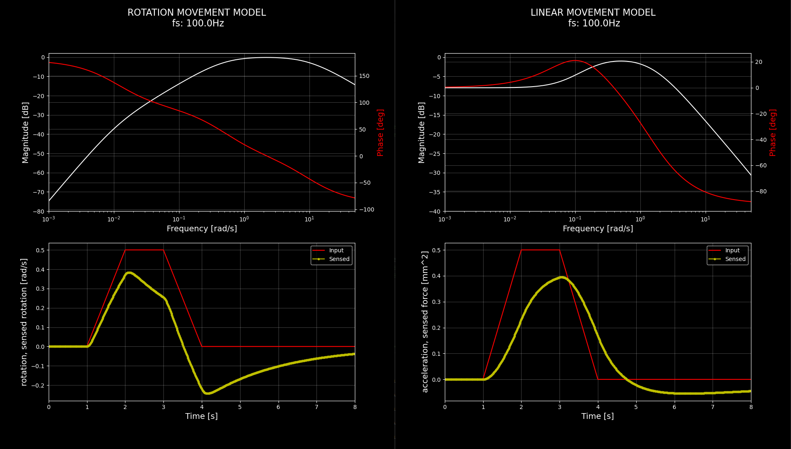

# StewardPlatformEvaluation
This repository contains all that is needed to implement software for steward platform

## Simulation of vestibular system
Models implemented in simulation of the vestibular system are based on this [article](https://www.researchgate.net/publication/261026446_Vehicle_modelling_and_washout_filter_tuning_for_the_Chalmers_Vehicle_Simulator).

##### Frequency and time response of model

